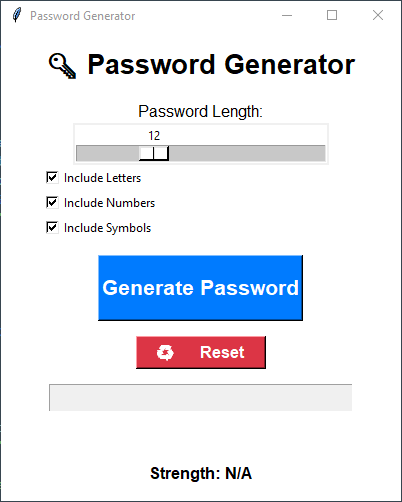

<h1 align="center"> 🔑 Password Generator </h1>

**Tagline**: Generate secure, customizable passwords instantly with an
easy-to-use Python GUI!

------------------------------------------------------------------------

## 📖 Description

The **Password Generator** is a Python desktop application built with
**Tkinter** that allows users to create strong and customizable
passwords.\
You can: - Adjust password length\
- Choose whether to include **letters, numbers, and symbols**\
- Instantly check password strength

It also includes **one-click copy to clipboard** and a **reset option**,
making it practical and user-friendly.

------------------------------------------------------------------------

## ✨ Features

-   **Adjustable Password Length** → Range: 4--32 characters\
-   **Include/Exclude Options** → Letters, numbers, and/or symbols\
-   **Randomized Passwords** → Uses Python's `random` and `string`
    libraries\
-   **Password Strength Indicator** → Labels passwords as Weak, Medium,
    or Strong\
-   **Copy to Clipboard** → Click the password field to copy instantly\
-   **Reset Button** → Quickly clear password & reset strength\
-   **Clean Tkinter GUI** → Minimal, modern, and responsive

------------------------------------------------------------------------

## 🧰 Tech Stack

  Category   Technology
  ---------- -----------------------------
  GUI        Tkinter
  Backend    Python (`random`, `string`)

------------------------------------------------------------------------

## 📂 Project Structure

    .
    ├── main.py        # Main application (GUI + password generator logic)
    ├── Screenshot.png # App screenshot
    └── README.md      # Project documentation

------------------------------------------------------------------------

## ⚙️ How to Run

1.  Make sure you have **Python 3.x** installed.\

2.  Clone or download this repository.\

3.  Open a terminal in the project folder.\

4.  Run the app with:

    ``` bash
    python main.py
    ```

------------------------------------------------------------------------

## 🚀 Usage

-   Adjust **Password Length** (4--32)\
-   Choose **Include Letters, Numbers, and Symbols**\
-   Click **Generate Password**\
-   Copy password by clicking on it\
-   Use **Reset** to clear and start fresh

------------------------------------------------------------------------

## 📸 Screenshot

Here's how the app looks in action:




------------------------------------------------------------------------

## 👤 Author

**Kaif Tarasagar**

-   [LinkedIn](https://www.linkedin.com/in/kaif-tarasgar-0b5425326/)
-   [Twitter/X](https://x.com/Kaif_T_200)

------------------------------------------------------------------------

## 📝 License

This project is licensed under the **[License: MIT](https://github.com/Kaif-T-200/CODSOFT_03_Pass-Gen/blob/main/LICENSE).**  
Feel free to use, modify, and distribute with attribution.
